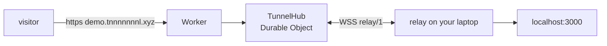

# Cloudflare Workers + Durable Objects

A second Relay backend. It needs no VPS and runs on the Workers **free** plan.
It speaks the same `relay/1` protocol as `relayd`, so the existing `relay`
client connects with no changes and no rebuild — only the server origin differs.



## Before you start

- A Cloudflare account. The free plan is enough.
- A domain using Cloudflare nameservers.
- Node 18 or newer, for `wrangler`.

## 1. Pick hostnames, one level deep

**Tunnels must be first-level subdomains of the zone.** Universal SSL covers
`tnnnnnnnl.xyz` and `*.tnnnnnnnl.xyz` only. A name like
`demo.tunnels.tnnnnnnnl.xyz` is two levels deep, gets no free certificate, and
needs paid Advanced Certificate Manager.

| Role | Example | Notes |
| --- | --- | --- |
| Control host | `relay.tnnnnnnnl.xyz` | `relay setup --server` points here |
| Tunnel suffix | `tnnnnnnnl.xyz` | tunnels become `demo.tnnnnnnnl.xyz` |

Because a wildcard route claims every subdomain on the zone, use a zone you do
not serve anything else from.

## 2. Add the DNS record

One proxied wildcard record. The address is never used — the Worker answers
before the origin is reached — so the documentation-reserved IP is fine.

| Record | Type | Value | Proxy |
| --- | --- | --- | --- |
| `*` | A | `192.0.2.1` | Proxied (orange cloud) |

The route only fires on proxied records. Grey-clouded records bypass Workers.

## 3. Configure and deploy

`cloudflare/wrangler.jsonc` is already set to `tnnnnnnnl.xyz`. Change `vars`
and `routes` there if you use a different zone. Then:

```sh
cd cloudflare
npm install
npx wrangler login

# Generate a token and store it as a secret. Keep the printed value.
openssl rand -hex 16
npx wrangler secret put RELAY_TOKEN

npx wrangler deploy
```

## 4. Enroll the client

```sh
relay setup --server https://relay.tnnnnnnnl.xyz
# Paste the token at the hidden prompt.

relay 3456 --name demo
# https://demo.tnnnnnnnl.xyz → localhost:3456
```

`relay setup` verifies the origin, the credentials, and the protocol version
before saving anything. The same client binary works against a VPS `relayd`;
run `relay setup` again to switch between them.

## Local testing

`wrangler dev` rewrites the request Host to match a configured route, which
defeats hostname routing. `wrangler.dev.jsonc` exists for that reason: it is
the same configuration with no `routes`, so the real Host passes through.

```sh
cd cloudflare && npm run dev          # uses wrangler.dev.jsonc, port 8787
```

```sh
RELAY_TOKEN=dev-token relay 3456 --server http://localhost:8787 --name demo
```

```sh
curl -H 'Host: demo.localhost' http://127.0.0.1:8787/
```

The token for local development comes from `cloudflare/.dev.vars`, which is
not committed. Run the protocol unit tests with `npm test`.

## Free-plan budget

| Limit | Free allowance | What consumes it |
| --- | --- | --- |
| Requests | 100,000 / day | visitor requests, **and every keepalive** |
| Duration | 13,000 GB-s / day | time the object is awake |

The client sends a keepalive every 10 seconds, so each connected tunnel spends
about 8,600 requests per day doing nothing. Roughly ten permanently connected
tunnels exhaust the free request budget on keepalives alone. Disconnect tunnels
you are not using.

Durable Objects on the free plan must use the SQLite storage backend, which is
why `wrangler.jsonc` declares `new_sqlite_classes`. Relay stores no persistent
state; only the class type matters.

## What this backend does not do yet

- **WebSocket extensions.** The upgrade request never offers
  `permessage-deflate`, because the bridge does not implement per-frame
  compression. Subprotocols are forwarded.
- **Streaming request bodies.** The request body is buffered to give the
  origin a `Content-Length`. Bodies over 25 MB get a 413.
- **Compression on the tunnel leg.** The Worker asks the origin for
  `Accept-Encoding: identity`. The Workers runtime treats a constructed
  Response body as already decoded, so forwarding a gzipped body makes the
  edge re-compress it and overwrite `Content-Encoding`, and the visitor
  renders raw gzip. Cloudflare still compresses at the edge, so the visitor
  gets brotli either way; only the laptop-to-edge hop is uncompressed. If an
  origin gzips regardless, the Worker decodes it with `DecompressionStream`.
- **Flow control.** Same unbounded-buffer trade-off as the VPS backend.
- **Sharding.** One Durable Object holds every tunnel. That is simple and
  correct, and it is a single-threaded throughput ceiling. Switch
  `idFromName("hub")` to `idFromName(name)` if one object saturates.

## Verified behaviour

Checked against the real Go client through `wrangler dev`:

| Case | Result |
| --- | --- |
| GET, headers and query forwarded | pass |
| Status codes preserved (404) | pass |
| 500 KB response body | byte-exact |
| `Transfer-Encoding: chunked` response | de-chunked correctly |
| Repeated `Set-Cookie` headers | both preserved |
| POST body round-trip | byte-identical |
| Unknown tunnel name | 404 |
| WebSocket upgrade (Next.js HMR) | 101, messages both ways |
| 8 concurrent 500 KB GETs | all byte-exact |
| 6 concurrent POST echoes | all byte-identical |

## Continuous deployment

Two workflows in `.github/workflows/`:

| Workflow | Trigger | Does |
| --- | --- | --- |
| `ci.yml` | push to master, any PR | gofmt, `go vet`, `go build`, `go test -race`, Worker unit tests, `wrangler deploy --dry-run` |
| `deploy.yml` | push to master touching `cloudflare/**` | `npm test`, then `wrangler deploy`, then a health probe |

### One-time setup

Add a repository secret named `CLOUDFLARE_API_TOKEN`:

1. https://dash.cloudflare.com/profile/api-tokens → Create Token
2. Use the **Edit Cloudflare Workers** template
3. Scope it to the zone serving your tunnels
4. GitHub → Settings → Secrets and variables → Actions → New repository secret

### What CD does not touch

`RELAY_TOKEN` is a Worker secret, set once with `wrangler secret put`. Deploys
never rotate it. If a deploy reset it, every enrolled client would be locked
out until it ran `relay setup` again.

The health probe expects **401** from `/_relay/check`. That is the correct
answer to an unauthenticated request, and it proves the route is live and the
Worker is running without putting a token in CI.

### Known skipped test

`TestWebSocketTunnelHTTPAndUpgrade` in `cmd/relayd` is skipped by default. It
fails about 13 runs in 15: concurrent large bodies truncate on the VPS
backend. Run it with `RELAY_FLAKY=1 go test ./cmd/relayd/`. The Cloudflare
backend passes the same workload, so the defect is in relayd, not the
protocol.
